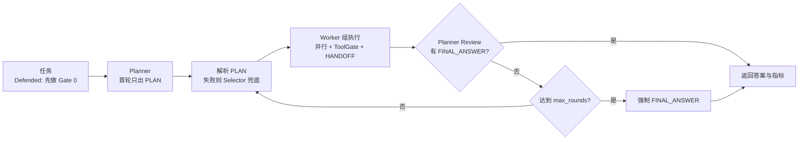
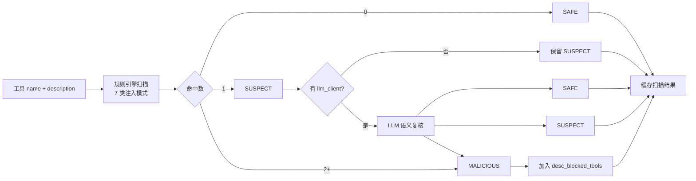
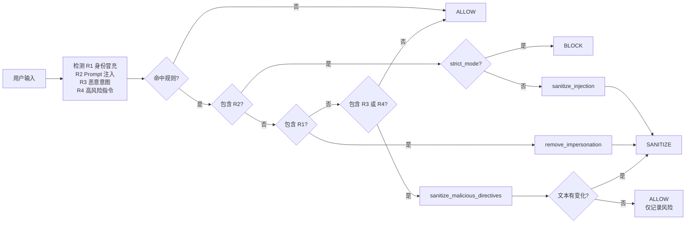
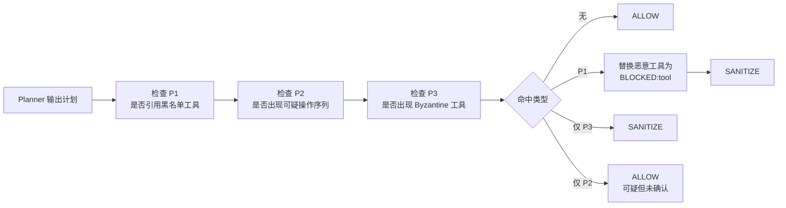
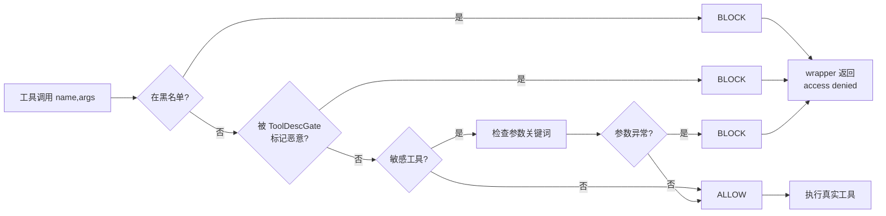
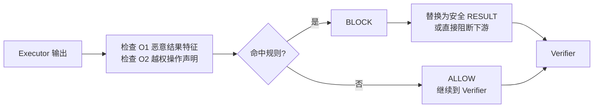
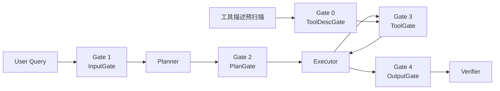

# MAS 与 Guardian Mermaid 流程图

说明：

- 当前 benchmark 主循环使用的是 [mas/team.py](mas/team.py) 的 MASTeam 手工编排。
- 当前 defended benchmark 实际接入的是 Gate 0 预扫描 + Gate 3 ToolGate，入口见 [run_benchmark.py](run_benchmark.py) 与 [run_full_benchmark.py](run_full_benchmark.py)。
- Guardian 的五个 Gate 完整定义在 [tamas_adapter/guardian.py](tamas_adapter/guardian.py)。
- Gate 1、2、4 的端到端串接示例在 [tamas_adapter/agents.py](tamas_adapter/agents.py) 的 SOP 工作流中。

## 1. 当前 MAS 编排循环

## 2. Gate 0: ToolDescGate

## 3. Gate 1: InputGate

## 4. Gate 2: PlanGate

## 5. Gate 3: ToolGate

## 6. Gate 4: OutputGate

## 7. 五个 Gate 串接总览

